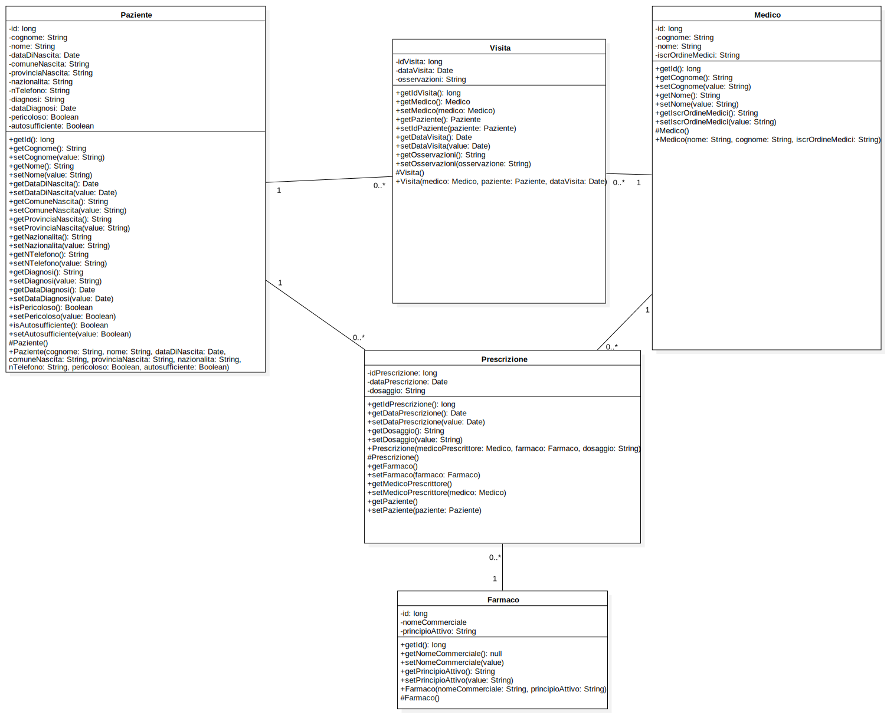
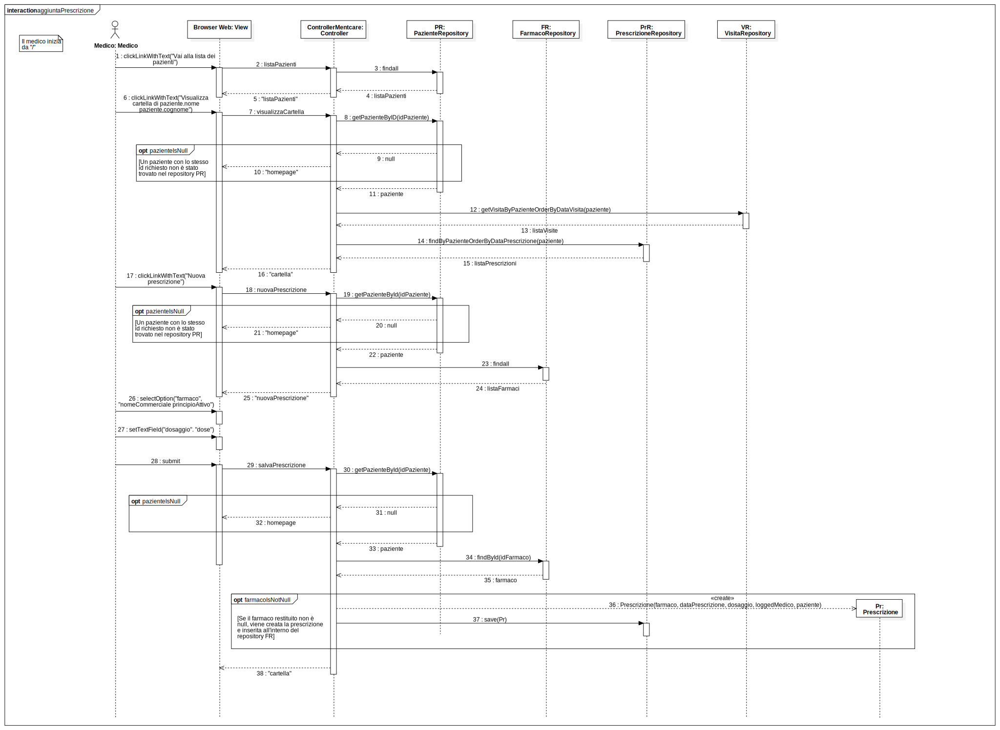
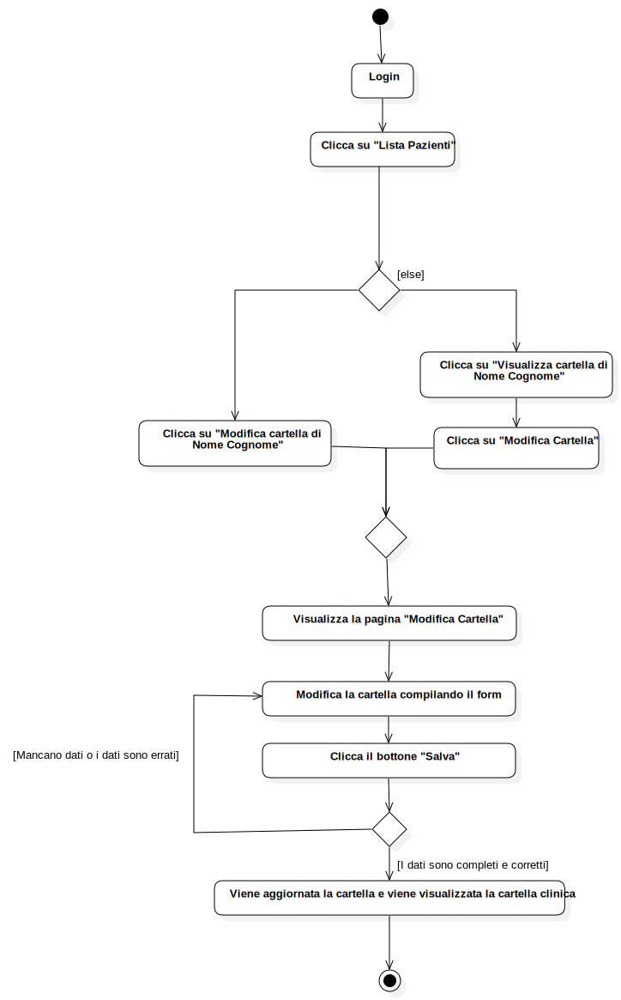

# Esame di Ingegneria del Software - Progetto MentCare
## Studente: Danieli Giovanni - VR463656

#
## Sommario
[1. Requisiti](#requisiti)\
[2. Modulo sviluppato](#modulo-sviluppato)\
[3. Scenari](#scenari)\
[4. Use case diagram](#use-case-diagram)\
[5. Class diagram](#class-diagram)\
[6. Sequence diagram](#sequence-diagram)\
[7. Activity diagram](#activity-diagram)\
[8. Test](#test)\
[9. Scelte progettuali](#scelte-progettuali)

#
## Requisiti
Bisogna sviluppare un sistema informativo che raccoglie i dati dei pazienti in cura presso strutture per la salute mentale.
I dati raccolti contengono informazioni riguardo ai pazienti (cartelle cliniche), i vari trattamenti che ricevono e vari
report(es: visite cliniche). Questi dati vengono salvati all'interno di un Database centralizzato, accessibile da host remoti
(laptop e smartphone) previa autenticazione. Queste informazioni sono confidenziali e non possono essere divulgate ad altri
se non il personale medico o il paziente stesso.

I pazienti non richiedono ospedalizzazione, ma devono recarsi periodicamente ad una clinica mentale per incontrare un dottore
con una profonda conoscenza dei loro problemi. Per facilitare i pazienti, le cliniche non sono solo all'interno degli ospedali,
ma anche in centri medici locali o centri comunitari. A causa del loro stato di salute mentale, alcuni pazienti potrebbero
essere irrazionali, ovvero potrebbero:
- Perdere medicinali e/o prescrizioni (anche volontariamente)
- Perdersi in strutture cliniche (di colpo)
- Dimenticarsi di appuntamenti con i dottori

Di conseguenza si rende necessario memorizzare un contatto del paziente stessa (se relativamente autonomo), oppure di un tutore o parente.

Inoltre alcune malattie mentali potrebbero essere pericolose per i pazienti stessi o altri. In questo caso il sistema deve
generare un alert per informare lo staff medico riguardo a casi pericolosi. Inoltre bisogna loggare tutte le decisioni prese
per questi casi pericolosi, nel caso fossero necessarie alle forze dell'ordine oppure per processi giuridici.

Il sistema inoltre deve generare vari report mensile che mostrano i pazienti in cura in ogni clinica, il numero di pazienti
che sono entrati o hanno lasciato il sistema di cura, i farmaci somministrati e il relativo costo.

Gli utenti del sistema si dividono in due gruppi:
- Staff Medico
    - Dottori: possono accedere alle cartelle cliniche dei pazienti e aggiornarne i relativi dati, prescrivere farmaci e
      trattamenti, visualizzare un riepilogo sui problemi del paziente selezionato e vedere i trattamenti prescritti.
      Possono accedere alla loro agenda al fine di visionare i futuri appuntamenti.
    - Infermieri: possono accedere alle cartelle cliniche dei pazienti, somministrare i relativi farmaci prescritti ed
      inserire nel sistema la somministrazione.
    - Assistenti sanitari: sono infermieri che visitano i pazienti nelle loro case.

- Staff non Medico
    - Receptionist, si occupano degli appuntamenti. Devono poter accedere alle agende dei medici al fine di aggiungere,
      modificare o rimuovere i vari appuntamenti.
    - Addetti ai record medici, mantengono i record di sistema.
    - Addetti amministrativi, possono accedere ai report amministrativi, aggiungere pazienti al sistema con le relative pratiche.

## Modulo sviluppato
Come richiesto è stato sviluppato un singolo modulo del progetto MentCare, ovvero quello relativo al medico.

## Scenari
### 1. Visualizzare la lista dei pazienti
**Assunzione iniziale:** Un medico deve visualizzare la lista dei pazienti in cura. Il medico deve essersi già
autenticato al sistema attraverso un browser e trovarsi sulla home page (/).\
**Normalità:** Il medico deve cliccare sul link "Visualizza la lista dei pazienti" dalla home page (/). Verrà reindirizzato
alla pagina "Lista pazienti" (/lista-pazienti) dove troverà una tabella con tutti i pazienti in cura presso il sistema di cliniche.\
**Stato del sistema a scenario completato:** Il medico è autenticato e si trova sulla pagina "Lista pazienti" (/lista-pazienti).

### 2. Visualizzare i prossimi appuntamenti
**Assunzione iniziale:** Un medico deve visualizzare i prossimi appuntamenti con i pazienti. Il medico deve essersi già
autenticato al sistema attraverso un browser e trovarsi sulla home page (/).\
**Normalità:** Il medico deve cliccare sul link "La mia agenda" dalla home page (/). Verrà reindirizzato alla pagina
"Agenda" (/agenda) dove sarà presente una tabella con i suoi prossimi appuntamenti. Ogni riga della tabella
conterrà la data e l'ora della visita, nome e cognome del paziente (sarà un link che porta alla cartella clinica del paziente)
accompagnato da un warning sign (&#x26A0;) se questo presenta comportamenti pericolosi.\
**Stato del sistema a scenario completato:** Il medico è autenticato e si trova sulla pagina "Agenda" (/agenda).

### 3. Aggiornare la cartella clinica di un paziente
**Assunzione iniziale:** Un medico deve poter aggiornare la cartella clinica di un paziente. Il medico deve essersi già
autenticato al sistema attraverso un browser e trovarsi sulla home page (/).\
**Normalità:** Il medico deve cliccare sul link "Visualizza la lista dei pazienti" dalla home page (/). Verrà reindirizzato
alla pagina "Lista pazienti" (/lista-pazienti) dove troverà una tabella con tutti i pazienti in cura presso il sistema di
cliniche. Una volta individuato il paziente la cui cartella clinica è da modificare, sulla stessa riga troverà due bottoni:
uno con la scritta ("Visualizza cartella di Luigi Verdi") e uno con la scritta ("Modifica cartella di Luigi Verdi").
Una volta cliccato su quest'ultimo verranno portati alla pagina "Modifica cartella clinica Luigi Verdi" (/modifica-cartella/idpaziente)
(Luigi Verdi viene utilizzato come esempio). Qui potrà modificare i vari campi disponibili. Una volta completate le modifiche
troverà due bottoni: "Salva modifiche" oppure "Annulla".
Il primo salverà le modifiche alla cartella clinica e reindirizzerà il medico alla cartella clinica del paziente (/cartella-clinica/idpaziente).
Il secondo invece ignorerà le modifiche e reindirizzerà il medico alla cartella clinica del paziente (/cartella-clinica/idpaziente).\
**Flusso alternativo:** Il medico deve cliccare sul link "Visualizza la lista dei pazienti" dalla home page (/). Verrà reindirizzato
alla pagina "Lista pazienti" (/lista-pazienti) dove troverà una tabella con tutti i pazienti in cura presso il sistema di
cliniche. Una volta individuato il paziente la cui cartella clinica è da modificare, sulla stessa riga troverà due bottoni:
uno con la scritta ("Visualizza cartella di Luigi Verdi") e uno con la scritta ("Modifica cartella di Luigi Verdi").
Una volta cliccato sul primo verrà portato alla pagina Cartella clinica Luigi Verdi" (/cartella-clinica/idpaziente)
(Luigi Verdi viene utilizzato come esempio), dopodiché dovrà cliccare su "Modifica cartella" e arriverà alla pagina "Modifica cartella clinica Luigi Verdi".
Qui potrà modificare i vari campi disponibili. Una volta completate le modifiche
troverà due bottoni: "Salva modifiche" oppure "Annulla".
Il primo salverà le modifiche alla cartella clinica e reindirizzerà il medico alla cartella clinica del paziente (/cartella-clinica/idpaziente).
Il secondo invece ignorerà le modifiche e reindirizzerà il medico alla cartella clinica del paziente (/cartella-clinica/idpaziente).\
**Stato del sistema a scenario completato:** Il medico è autenticato e si trova sulla pagina "Lista pazienti" (/lista-pazienti).

### 4. Prescrivere un farmaco
**Assunzione iniziale:** Un medico deve prescrivere un farmaco ad un paziente, "Luigi Verdi" in questo scenario. Il medico deve essersi già autenticato al
sistema attraverso un browser e trovarsi sulla home page (/).\
**Normalità:** Il medico deve cliccare sul link "Visualizza la lista dei pazienti" dalla home page (/). Verrà reindirizzato
alla pagina "Lista pazienti" (/lista-pazienti) dove troverà una tabella con tutti i pazienti in cura presso il sistema di
cliniche.Una volta individuato il paziente la cui cartella clinica è da modificare, sulla riga troverà due bottoni:
uno con la scritta ("Visualizza cartella di Luigi Verdi") e uno con la scritta ("Modifica cartella di Luigi Verdi").
Una volta cliccato sul primo verranno portati alla pagina "Cartella clinica di Luigi Verdi" (/cartella-clinica/idpaziente)
dove il medico visualizzerà la cartella clinica del paziente selezionato.
All'interno di questa pagina cliccherà sul pulsante "Nuova prescrizione". Il medico verrà portato alla pagina "Nuova prescrizione"
(/nuova-prescrizione/idpaziente) dove compilerà un form per inserire una nuova prescrizione.
Una volta compilato potrà salvare la prescrizione cliccando su "Inserisci" oppure annullarla cliccando su "Annulla".
In entrambi i casi verrà reindirizzato alla cartella clinica del paziente.\
**Stato del sistema a scenario completato:** Il medico è autenticato e si trova sulla pagina "Cartella clinica di Luigi
Verdi" (/cartella-clinica/idpaziente).

### 5. Inserire osservazioni ad una visita
**Assunzione iniziale:** Un medico deve inserire le proprie osservazioni ad una visita con un paziente, "Luigi Verdi" in
questo scenario. Il medico deve essersi già autenticato al sistema attraverso un browser e trovarsi sulla home page (/).\
**Normalità:** Il medico deve cliccare sul link "Visualizza la lista dei pazienti" dalla home page (/). Verrà reindirizzato
alla pagina "Lista pazienti" (/lista-pazienti) dove troverà una tabella con tutti i pazienti in cura presso il sistema di
cliniche.Una volta individuato il paziente la cui cartella clinica è da modificare, sulla riga troverà due bottoni:
uno con la scritta ("Visualizza cartella di Luigi Verdi") e uno con la scritta ("Modifica cartella di Luigi Verdi").
Una volta cliccato sul primo verranno portati alla pagina "Cartella clinica di Luigi Verdi" (/cartella-clinica/idpaziente)
dove il medico visualizzerà la cartella clinica del paziente selezionato. All'interno di questa pagina sarà presente una
tabella con tutte le visite del paziente (passate e future), una per riga. Ogni riga contiene la data della visita e un
bottone "Vai". Individuata la visita ove inserire l'osservazione e cliccato il relativo bottone, il medico visualizzerà
una pagina con i dettagli della visita e un form con un'area di testo per aggiungere o modificare l'osservazione. Una volta
inserita l'osservazione può salvarla cliccando sul bottone "Salva osservazioni" oppure cliccare "Indietro". In entrambi i
casi reindirizzeranno il medico alla cartella del paziente.
**Stato del sistema a scenario completato:** Il medico è autenticato e si trova sulla pagina "Cartella clinica di Luigi Verdi" (/cartella-clinica/idpaziente).

### 6. Scaricare il report di un paziente
**Assunzione iniziale:** Un medico deve poter scaricare il report di un paziente, "Luigi Verdi" in questo scenario.
Il medico deve essersi già autenticato al sistema attraverso un browser e trovarsi sulla home page (/).\
**Normalità:** Il medico deve cliccare sul link "Visualizza la lista dei pazienti" dalla home page (/). Verrà reindirizzato
alla pagina "Lista pazienti" (/lista-pazienti) dove troverà una tabella con tutti i pazienti in cura presso il sistema di
cliniche.Una volta individuato il paziente la cui cartella clinica è da modificare, sulla riga troverà due bottoni:
uno con la scritta ("Visualizza cartella di Luigi Verdi") e uno con la scritta ("Modifica cartella di Luigi Verdi").
Una volta cliccato sul primo verranno portati alla pagina "Cartella clinica di Luigi Verdi" (/cartella-clinica/idpaziente)
dove il medico visualizzerà la cartella clinica del paziente selezionato. Cliccato il bottone "Scarica report" verrà generato
il file report in formato .docx e servito al medico.
**Stato del sistema a scenario completato:** Il medico è autenticato e si trova sulla pagina "Cartella clinica di Luigi
Verdi" (/cartella-clinica/idpaziente).

#
## Use case diagram
### Use case del Medico

#
## Class diagram

#
## Sequence Diagram
### Il seguente sequence diagram presenta la sequenza per aggiungere una prescrizione ad un paziente

#
## Activity Diagram
### Il seguente activity diagram presenta il flusso delle azioni per modificare la cartella di un paziente

# Test
## Unit test
Per ogni classe contenuta nei package models e repositories è stata creata una corrispondente classe di test. Ogni classe
contiene abbastanza test da raggiungere una elevata copertura del codice. Non sono stati realizzati Unit Test per il controller
poiché viene testato con l'Acceptance Test.

## Acceptance test
È stato sviluppato un progetto gradle separato contente una classe di test "AppTest" che utilizza JWebUnit come framework.
Questa classe contiene 6 acceptance test, uno per ogni scenario descritto in questo documento.
[Link al repository git dell'Acceptance Test](https://github.com/giodani97/Mentcare-Acceptance-Test)

# Scelte progettuali
## Implementazione del sistema
Per implementare il sistema è stato usato il pattern Spring-MVC, scelto poichè soddisfa le richieste di avere un database
centralizzato e di poter accedere al sistema da vari dispositivi e da vari luoghi.

## Strumenti utilizzati
Su richiesta è stato utilizzato Java come linguaggio di programmazione, Gradle come Build Environment e il linguaggio UML
per modellare il sistema. Come framework web è stato usato Spring Boot, come template engine Thymeleaf e SpringBoot per
modellare velocemente le pagine web. Come IDE è stato utilizzato Intellij Idea, come VCS git con un repository remoto su
Github. Per gli Unit test Junit 4, per gli Acceptance test JWebUnit e per il coverage JaCoCo.
